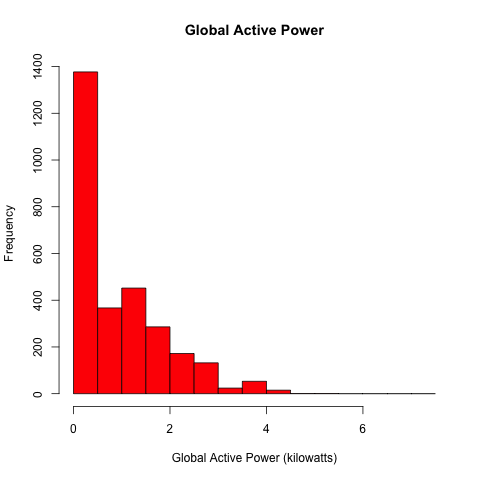
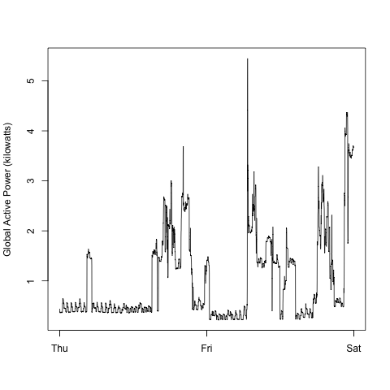
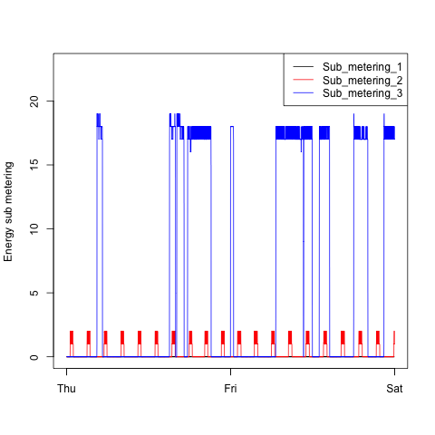
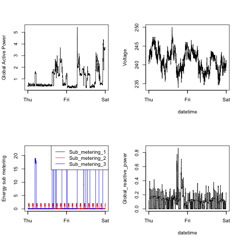

# EDA: Week 1 Project

## __Process__

I created a `data` directory to house the raw data. In that directory find an R script `subset_data.R` that transforms the original data set into the subsetted data for 2/1/2007 and 2/2/2007. The subsetted data is stored in the same directory as `household_power_consumption.csv`, which is used in the R scripts to create the plots below. The I added the raw data file to the `.gitignore`, but it can be downloaded from the Coursera link __[HERE](https://d396qusza40orc.cloudfront.net/exdata%2Fdata%2Fhousehold_power_consumption.zip)__ (file is 20Mb).

In the root directory, find the four R scripts, `plot1.R`, `plot2.R`, etc., and the four PNG files the produce, which are shown below.

## __The Plots__

### Plot 1

### Plot 2

### Plot 3

### Plot 4

## __Notes__

I noticed that data shown in my plots were not *__EXACT__* to the plots in the original project repo that was forked. From what I can tell, I have subsetted my data to the correct dates specified in the project instructions on Coursera. Either the the data changed from the first time those plots were created, the instructor used a different Thursday-Friday date range, or I subsetting incorrectly. It's hard to tell what the reason for the differences is without having access to the data set and code that produced the original plots.
